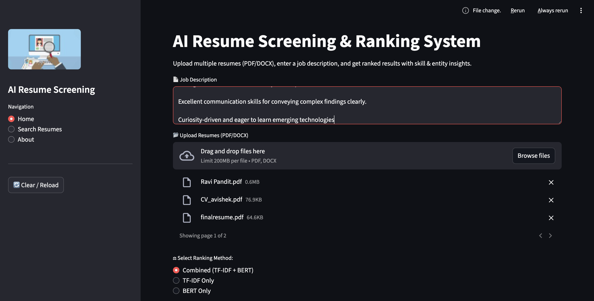
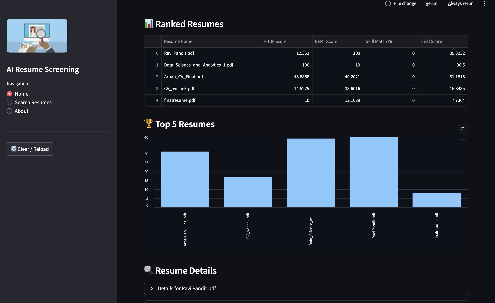

# AI Resume Screening & Ranking System

## Overview
This AI-powered resume screening and ranking system leverages **Natural Language Processing (NLP)** and **Machine Learning** to analyze, extract, and rank resumes based on their relevance to a job description. It uses **TF-IDF**, **BERT embeddings**, and **skill matching** from a curated skills database to provide accurate and actionable insights.

---

## Features

- **Multi-format Resume Processing**: Extract text from **PDF** and **DOCX** files, including image-based PDFs via OCR.
- **Similarity Scoring**:
  - **TF-IDF** cosine similarity
  - **BERT embeddings** semantic similarity
  - **Hybrid (combined) scoring**
- **Skill Extraction & Matching**:
  - Fuzzy matching against a **skills database**
  - Skills grouped by **categories** (e.g., Programming, Machine Learning, HR, Analytics)
  - **Weighted Skill Match Score** between JD and resumes
- **Named Entity Recognition**: Extract organizations, dates, locations, and person names from resumes.
- **Ranking & Analytics**:
  - Normalize similarity scores for easier interpretation
  - Rank resumes by **Final Score** (weighted combination of TF-IDF/BERT + skill match)
  - View **top 5 candidates** visually
- **Search Functionality**: Filter resumes by **name** or **keywords**
- **Download Options**:
  - Export **ranked results as CSV**
  - Convert **DOCX resumes to PDF** for convenient access
- **Session Management**: Clear or reload session data anytime

---

## Demo Screenshots

### Input
The user enters the job description and uploads resumes:



### Output
Ranked resumes with detailed results including scores and charts:




---

## Installation

### Prerequisites
- Python 3.8+
- Pip package manager
- Virtual environment (optional but recommended)

### Clone the Repository
```bash
git clone https://github.com/yourusername/AI-Resume-Ranking.git
cd AI-Resume-Ranking
```
### Create a Virtual Environment (Optional)
```bash
git clone https://github.com/yourusername/AI-Resume-Ranking.git
cd AI-Resume-Ranking
```

### Install Dependencies
```bash
pip install -r requirements.txt
```

--- 

### Usage
## Run the Streamlit application:
```bash
streamlit run app.py
```


## How to Use

To utilize the AI Resume Ranking application, follow these steps:

1.  **Enter a Job Description:** Input the desired job description into the provided text area.
2.  **Upload Resumes:** Upload resumes in either PDF or DOCX format.
3.  **Choose the Ranking Method:** Select one of the available ranking methods:
    *   **Combined:** Utilizes a blend of techniques for comprehensive ranking.
    *   **TF-IDF only:** Ranks based solely on TF-IDF text vectorization.
    *   **BERT only:** Employs BERT for semantic similarity.
4.  **Click Process:** Initiate the resume ranking by clicking the "Process" button.
5.  **View Ranked Results:** Once processed, you can view the ranked resumes along with detailed analytics, which include:
    *   Skill categories
    *   Named entities
    *   Final score breakdown
6.  **Use Search Resumes:** Filter the results by keywords or names using the "Search Resumes" functionality.
7.  **Download Results:** Download the ranked results as a CSV file, or download individual resumes (with DOCX files offering PDF conversion).


---
## Technologies Used

*   **Python:** Backend processing
*   **Streamlit:** Web UI
*   **spaCy:** NLP processing
*   **Sentence Transformers (BERT):** Semantic similarity
*   **TF-IDF:** Text vectorization
*   **PyMuPDF & Pytesseract:** PDF processing and OCR
*   **Pandas, NumPy, Scikit-Learn:** Data handling and machine learning
*   **RapidFuzz:** Fuzzy skill matching

---

## Folder Structure
``` bash
AI-Resume-Ranking/
│── images/ # UI and demo images
│── app.py # Streamlit application
│── requirements.txt # Python dependencies
│── README.md # Project documentation
│── data/ # Sample resumes or skill CSV
│── utils/ # Utility modules (file, NLP, normalization)
└── models/ # Pretrained NLP models (optional)
```
---
## Upcoming Upgrades

The following features are planned for future updates to enhance the functionality and user experience of the application:

*   **Integration with Kaggle datasets** for real-time job and skill data.
*   **Automated skill category expansion** using AI-based classification.
*   **Enhanced semantic matching** using advanced transformer models (e.g., BERT-large or RoBERTa).
*   **Interactive dashboard** to visualize top candidates, skills distribution, and similarity heatmaps.
*   **Resume parsing improvements** for handling multiple languages and mixed-format resumes.
*   **Admin panel** for bulk resume uploads, approval workflow, and analytics tracking.
*   **Improved OCR accuracy** for scanned or handwritten resumes.

---
## License

This project is licensed under the MIT License. See `LICENSE` for details.


---
## Author

Developed by Arpan Neupane – Feel free to contribute, report issues, or suggest improvements!# AI-Resume-Screening
